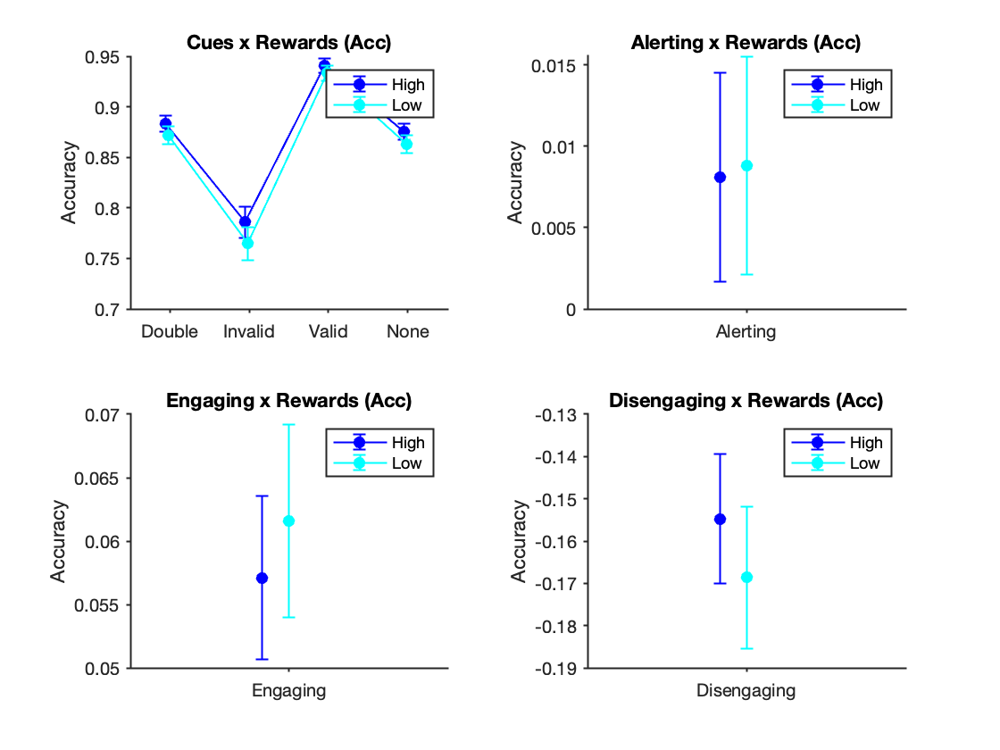
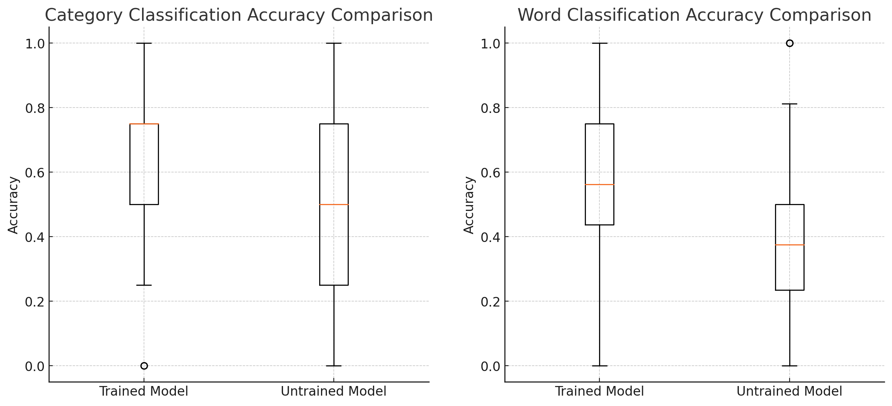

# Portfolio
---
## Personal Projects

### Optimized Shift Scheduling with Linear Programming

This project addresses the growing need for flexibility in shift scheduling, [a challenge which gained recognition during the Covid-19 pandemic](https://shift.hks.harvard.edu/wp-content/uploads/2022/01/COVIDUpdate_Brief_Final.pdf). Built for staffing managers, this scheduling tool leverages linear programming to optimize shift assignments based on worker preferences. Managers can specify required staffing levels for each day, and the tool generates schedules that balance employee preferences with cost considerations, including overtime payments.

##### Key Features:
- Flexible inputs for shift preferences and staffing requirements.  
- Cost computation that accounts for regular and overtime shifts.  
- Results in optimized schedules that accommodate worker preferences while meeting staffing demands.

Planned enhancements include incorporating workplace regulations, such as limits on overtime shifts and prioritizing regular shifts over overtime, for more robust scheduling capabilities.

---
## Research Projects

### Investigating the Impact of Rewards on Attentional Networks

As a research assistant at the Shenhav Lab, I designed and conducted an experiment to explore how rewards influence attentional networks. The experiment involved modifying a well-known attention experiment, [Posner Task](https://www.sciencedirect.com/science/article/abs/pii/S1053811905000984?via%3Dihub), by adding rewards to specific blocks of trials. Accuracy and reaction times were compared across blocks to understand the effect of rewards on attention.

##### Technical Highlights:
- Developed the experiment interface using HTML, CSS, and JavaScript with the JsPsych cognitive experiment library.
- Deployed the experiment on Cognition's experiment hosting platform for participation and data collection.
- Conducted statistical analysis using linear mixed-effects modeling in MATLAB (lmefit and glmefit), employing Satterthwaite approximation to model reaction times and estimate effective degrees of freedom

## Academic Projects

### Hateful Memes Detection

As part of efforts to detect and flag hateful speech on its platform, Meta launched the [Hateful Memes Challenge](https://ai.meta.com/blog/hateful-memes-challenge-and-data-set/) in 2020, in which participants were tasked with building AI models to detect hateful content in multimodal memes. For our final project in [Deep Learning (CS7643)](https://omscs.gatech.edu/cs-7643-deep-learning), my group modified and tested a variety of early and intermediate fusion models along with a HateCLIPper architecture based model on the Hateful Memes dataset. By pairing the naive HateCLIPper model with a modified HateCLIPper model (e.g. replacing the Feature Interaction Matrix layer with an Elementwise Fusion Layer), we created an ensemble model which outperformed the naive HateCLIPper model which won the original competition.

### Evaluating GPT Model Performance on NYT Puzzle Game Connections

As my final project for Georgia Tech's Intro to Cognitive Science course I devised an experiment to assess whether training can improve GPT's performance on the New York Times' puzzle game Connections. In the game, players are presented with 16 words and are tasked with grouping the words into categories based on an underlying semantic connection. Connections in the game can be difficult to detect, designed intentionally to deceive players into falsely grouping words together. For language models such as GPT, this game represents an opportunity to demonstrate how language models can be used to detect more ambiguous relationships between words and whether this detection can be learned.

Overall the research demonstrated that training did help the model's ability to detect connections however the model demonstrated limitations with more ambiguous word connections. The final project identified several hypotheses for why language models may struggle with this task, including language models reliance on word embeddings which conflicts with the game's use of syllable based connections. This area may serve as an avenue for future research, if one built a syllable based model. 

## Filmed by me

Besides Data Science, I also have a great passion for photography and videography. Below is a list of films I documented to retain beautiful memories of places I traveled to and amazing people I met on the way.

 

- [Ada Von Weiss - You Regret (Winter at Niagara)](https://www.youtube.com/watch?v=-5esqvmPnHI)
- [The Weight We Carry is Love - TORONTO](https://www.youtube.com/watch?v=vfZwdEWgUPE)
- [In America - Boston 2017](https://www.youtube.com/watch?v=YdXufiebgyc)
- [In America - We Call This Place Our Home (Massachusetts)](https://www.youtube.com/watch?v=jzfcM_iO0FU)

---

© 2024 Christopher Bravo. Powered by Jekyll and the Minimal Theme.
